# System Architecture Diagram

## Catalyst Onboarding System — 4-Layer Architecture

```mermaid
flowchart TD
    A[Prospect Client] -->|Submits form| B[Intake Layer\nGoogle Forms / Typeform]
    B -->|Webhook / trigger| C[Automation Engine\nZapier / Make.com]
    C -->|Create record| D[CRM Layer\nAirtable / Notion]
    C -->|Send email| E[Email / Calendar\nGmail / Calendly / Outlook]
    C -->|Notify advisor| F[Advisor Notification]
    D -->|CRM update event| C
    C -->|Refresh data| G[Reporting Layer\nGoogle Sheets Dashboard]
    C -->|Log entry| H[Error Log\nCRM or Sheets tab]
    H -->|Admin alert| I[Systems Administrator]

    style B fill:#e8f4fd,stroke:#2196F3
    style D fill:#e8f5e9,stroke:#4CAF50
    style C fill:#fff3e0,stroke:#FF9800
    style G fill:#fce4ec,stroke:#E91E63
    style H fill:#f3e5f5,stroke:#9C27B0
```

## Data Flow Summary

| Flow | Direction | Description |
|---|---|---|
| Intake → Automation | Prospect Client → Automation Engine | Form submission webhook delivers payload |
| Automation → CRM | Automation Engine → CRM Layer | Creates/updates Leads_Table and Workflow_Status_Table records |
| CRM → Automation | CRM Layer → Automation Engine | CRM update events trigger downstream automations |
| Automation → Email | Automation Engine → Email/Calendar | Welcome email and advisor notifications |
| Automation → Reporting | Automation Engine → Dashboard | Metric values and refresh timestamp written to Sheets |
| Automation → Error Log | Automation Engine → Error Log | All failures logged with structured metadata |
| Error Log → Admin | Error Log → Systems Administrator | Admin notifications for Automation Failure entries |
